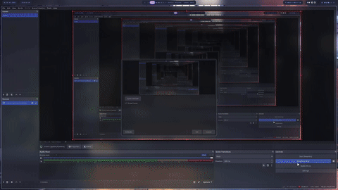
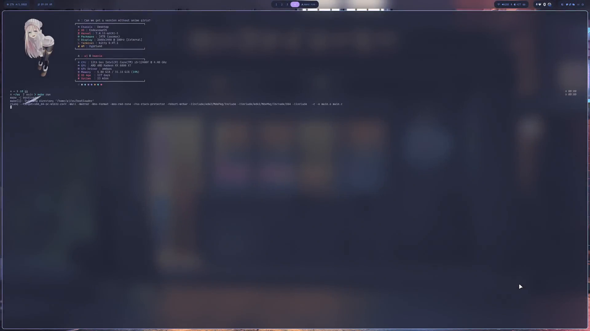

# DISCLAIMER, THIS CANNOT BE HOSTED ON ANYTHING BECAUSE THIS IS AN EFI APPLICATION. PLEASE UNDERSTAND. HERES A DEMO URL https://www.youtube.com/watch?v=-Udu0EeAm7w


# beanEFI

beanEFI is a project i made to learn about the bootloader and how my linux boots up.

The project is written entirely in C and compiled with **Clang** targeting the **PE/COFF** executable format (`BOOTX64.EFI`), which is the executable format required by UEFI firmware.

Instead of using the full EDK II build system, `beanEFI` only uses the **EDK II header files**. These headers provide the UEFI data structures, protocols, GUIDs, and function definitions needed to communicate with the firmware while keeping the build process simple and transparent.

During development, the project runs inside **QEMU** using the **OVMF** (Open Virtual Machine Firmware) UEFI firmware image. OVMF is an open-source implementation of the UEFI specification, allowing the bootloader to be tested without requiring physical hardware.


---

## Demo & Screenshots

Here is `beanEFI` in action, drawing a custom font rendering "beanie" in a shifting rainbow color palette:



*Static screenshot:*


---

## Architecture & Specifications

The build process is kept pretty simple because the goal of this project was to actually understand how UEFI works instead of hiding everything behind a huge build system.

The code is written in C and compiled using **Clang** targeting `x86_64-pc-win32-coff`, which makes the output a **PE32+ (PE/COFF)** executable (`BOOTX64.EFI`). This is the format that 64-bit UEFI firmware expects. The binary is then linked using **LLD**.

When the machine starts, OVMF looks for `EFI/BOOT/BOOTX64.EFI`, loads it into memory, and jumps into the `efi_main()` function. It also gives the program an `EFI_SYSTEM_TABLE`, which contains all the interfaces provided by the firmware.

---

## Getting Started

### Prerequisites

Ensure you have the following packages installed on your Linux system:

```sh
# On Debian/Ubuntu based systems:
sudo apt install clang lld qemu-system-x86_64 mtools dosfstools
```

```sh
# On Arch:
yay -S clang lld qemu-desktop mtools dosfstools
```

### Building and Running

1. **Clone the repository:**
   ```sh
   git clone https://github.com/BeanieMen/beanEFI.git
   cd beanEFI
   ```

2. **Build and launch in QEMU:**
   ```sh
   make run
   ```

---


# disclaimer
ai was used in the making of this application
